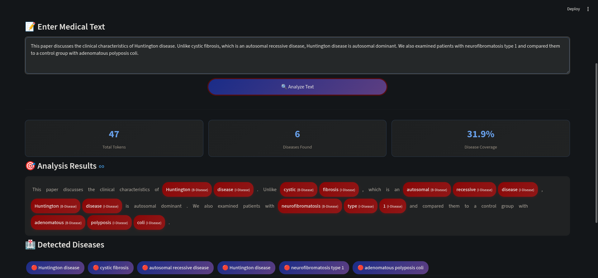
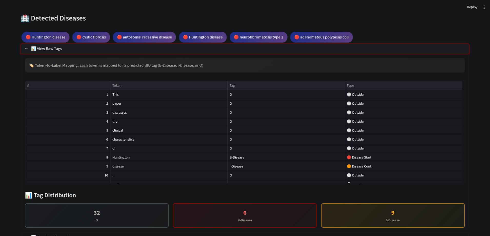
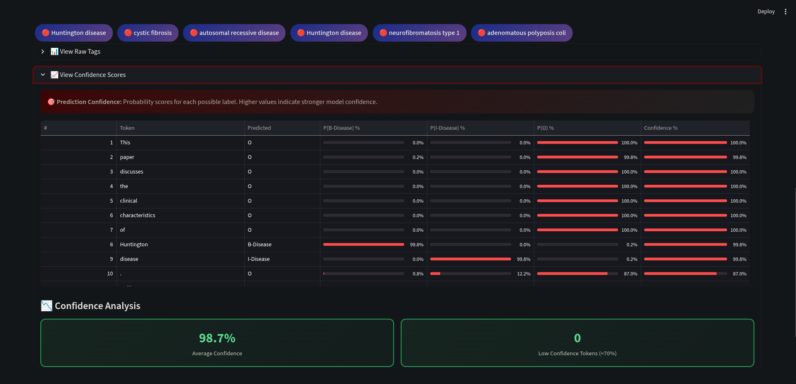

# 🧬 Disease Named Entity Recognition System

A modern web application for identifying disease mentions in medical text using **Conditional Random Fields (CRF)** machine learning model trained on the **NCBI Disease Corpus**.


---

## 📋 Table of Contents

- [Overview](#-overview)
- [Features](#-features)
- [Project Structure](#-project-structure)
- [Installation](#-installation)
- [Usage](#-usage)
- [Model Training](#-model-training)
- [Technical Details](#-technical-details)
- [Screenshots](#-screenshots)
- [Authors](#-authors)

---

## 🎯 Overview

This project implements a **Named Entity Recognition (NER)** system specifically designed to identify and extract disease mentions from biomedical and clinical text. The system uses a Conditional Random Fields (CRF) model, which is particularly effective for sequence labeling tasks in NLP.

### Why CRF for NER?

- **Sequential dependencies**: CRF models consider the context of neighboring words
- **Feature-rich**: Supports diverse linguistic features (POS tags, prefixes, suffixes, etc.)
- **Probabilistic outputs**: Provides confidence scores for predictions
- **No deep learning overhead**: Efficient training and inference

---

## ✨ Features

| Feature                     | Description                                            |
| --------------------------- | ------------------------------------------------------ |
| 🔍 **Real-time Analysis**   | Instant disease detection in any medical text          |
| 🎨 **Modern UI**            | Beautiful, responsive interface built with Streamlit   |
| 📊 **Statistics Dashboard** | Token counts, disease coverage, and more               |
| 🏷️ **Raw Tag Viewer**       | Detailed BIO tagging with visual indicators            |
| 📈 **Confidence Scores**    | Probability analysis with visual progress bars         |
| 🏥 **Disease Extraction**   | Automatic extraction and display of full disease names |

---

## 📁 Project Structure

```
Disease-NER-System/
│
├── 📄 app.py                 # Streamlit web application
├── 📄 train_model.py         # Model training script
├── 📄 Project.ipynb          # Jupyter notebook for experimentation
├── 📄 Testing Texts.txt      # Sample texts for testing
├── 📄 disease_ner_model.pkl  # Trained CRF model (generated after training)
├── 📄 README.md              # Project documentation
└── 📄 requirements.txt       # Python dependencies
```

---

## 🚀 Installation

### Prerequisites

- Python 3.10 or higher
- pip (Python package manager)

### Step 1: Clone the Project

```bash
git clone https://github.com/scorpionTaj/Disease-Named-Entity-Recognition-System.git
cd Disease-Named-Entity-Recognition-System
```

### Step 2: Create Virtual Environment (Recommended)

```bash
python -m venv venv
source venv/bin/activate  # On Windows: venv\Scripts\activate
```

### Step 3: Install Dependencies

```bash
pip install -r requirements.txt
```

---

## 💻 Usage

### Step 1: Train the Model (First Time Only)

```bash
python train_model.py
```

This will:

- Download the NCBI Disease Corpus
- Extract features from the training data
- Train the CRF model
- Save the model as `disease_ner_model.pkl`
- Display evaluation metrics (accuracy, precision, recall, F1-score)

### Step 2: Run the Web Application

```bash
streamlit run app.py
```

The application will open in your default web browser at `http://localhost:8501`

### Step 3: Analyze Text

1. Enter or paste medical text in the input area
2. Click **"🔍 Analyze Text"**
3. View the results:
   - Highlighted disease mentions
   - Statistics (token count, diseases found, coverage)
   - Raw BIO tags
   - Confidence scores

---

## 🔬 Model Training

### Dataset: NCBI Disease Corpus

The model is trained on the [NCBI Disease Corpus](https://www.ncbi.nlm.nih.gov/CBBresearch/Dogan/DISEASE/); the processed dataset used in this project was obtained from the GitHub repository [spyysalo/ncbi-disease](https://github.com/spyysalo/ncbi-disease), which contains:

- **793** PubMed abstracts
- **6,892** disease mentions
- **790** unique disease concepts

### Features Used

| Feature Type      | Examples                                     |
| ----------------- | -------------------------------------------- |
| **Lexical**       | Word lowercase, stem                         |
| **Morphological** | Prefixes (1-3 chars), Suffixes (1-4 chars)   |
| **Orthographic**  | Is title case, all caps, has digit, has dash |
| **Contextual**    | Previous/next word, POS tags                 |
| **Special**       | Greek letters, Roman numerals                |

### BIO Tagging Scheme

- **B-Disease**: Beginning of a disease mention
- **I-Disease**: Inside (continuation) of a disease mention
- **O**: Outside (not a disease)

### Model Performance

After training, you'll see metrics like:

```
>>> Global Accuracy: ~0.97
>>> ROC AUC Score: ~0.98

Classification Report:
              precision    recall  f1-score
B-Disease       0.87       0.79      0.82
I-Disease       0.84       0.81      0.82
```

---

## 🔧 Technical Details

### Architecture

```
Input Text → Tokenization → Feature Extraction → CRF Model → BIO Tags → Disease Extraction
```

### Key Components

1. **Tokenizer**: NLTK `word_tokenize`
2. **POS Tagger**: NLTK `averaged_perceptron_tagger`
3. **Stemmer**: Porter Stemmer
4. **Model**: sklearn-crfsuite CRF with L-BFGS optimization

### API Endpoints (Streamlit)

The app provides an interactive web interface with:

- Text input area
- Analysis button
- Results visualization
- Expandable sections for detailed data

---

## 📸 Screenshots

### Main Interface

The modern, gradient-styled header with input area for medical text.


### Statistics Dashboard & Analysis Results

Highlighted disease mentions with BIO tags displayed inline & Three-column layout showing:

- Total Tokens
- Diseases Found
- Disease Coverage %



### Raw Tags View

Interactive table with:

- Token index
- Token text
- BIO tag
- Visual tag type indicator
- Tag distribution chart



### Confidence Scores View

Detailed probability table with:

- Per-label probabilities (with progress bars)
- Overall confidence score
- Low-confidence token warnings



---

## 📚 References

- [NCBI Disease Corpus](https://www.ncbi.nlm.nih.gov/CBBresearch/Dogan/DISEASE/)
- [sklearn-crfsuite Documentation](https://sklearn-crfsuite.readthedocs.io/)
- [Streamlit Documentation](https://docs.streamlit.io/)
- [NLTK Documentation](https://www.nltk.org/)

---

## 👥 Authors

**Master SDIA - S03**  
NLP et Web Mining - Projet 1

- [Tajeddine Bourhim (ScorpionTaj)](https://github.com/Scorpiontaj)
- [Anass Zbir](https://github.com/ana3ss7z)
- [Nawfal Khallou]()

---

## 📄 License

This project is developed for educational purposes as part of the Master SDIA curriculum.

---

<div align="center">
  <p>Made with ❤️ using Streamlit & CRF</p>
  <p>🧬 Advancing Medical Text Analysis with NLP 🧬</p>
</div>
